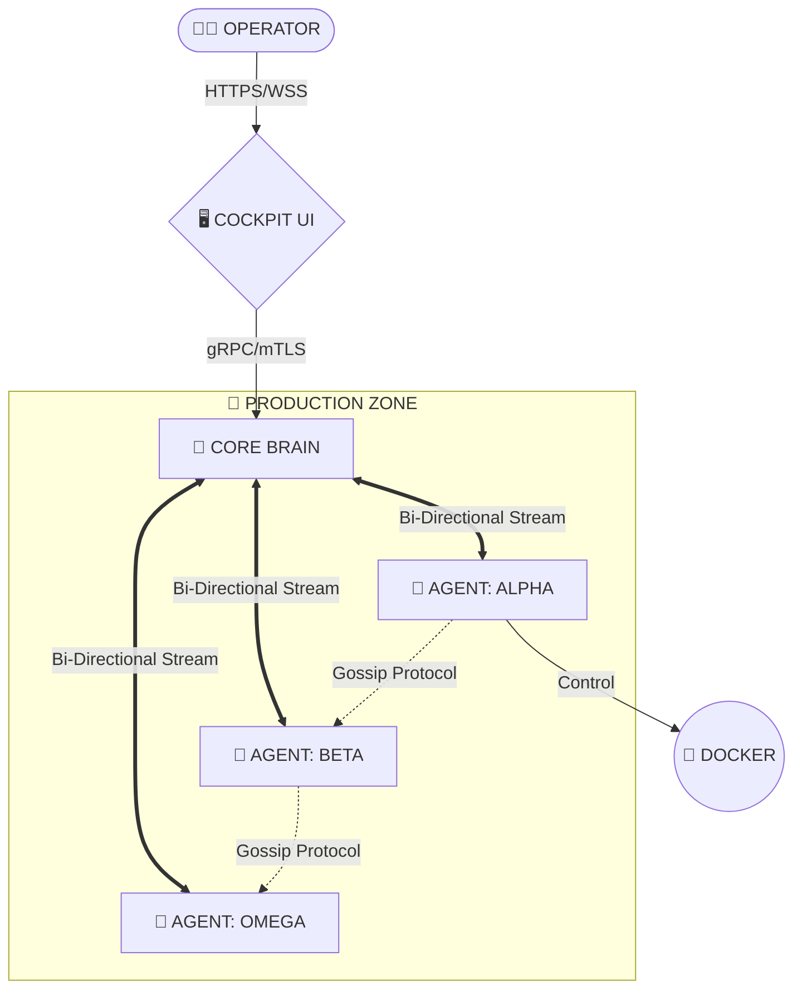

<!--
██     ██  ██████  ██████  ██████  ███████ ███    ██ 
██     ██ ██    ██ ██   ██ ██   ██ ██      ████   ██ 
██  █  ██ ██    ██ ██████  ██████  █████   ██ ██  ██ 
██ ███ ██ ██    ██ ██   ██ ██      ██      ██  ██ ██ 
 ███ ███   ██████  ██   ██ ██      ███████ ██   ████ 
-->

<div align="center">

# ⚡ 𝐖 𝐎 𝐑 𝐏 𝐄 𝐍 ⚡
### ᴛʜᴇ ᴅɪɢɪᴛᴀʟ ɴᴇʀᴠᴏᴜs sʏsᴛᴇᴍ

[](https://github.com/worpen/core)
[](LICENSE)
[](https://github.com/worpen/core/releases)
[](https://status.worpen.io)

<p align="center">
  <b>Orchestration</b> • <b>Self-Healing</b> • <b>Observability</b> • <b>Zero-Trust</b>
</p>

</div>

---

## 📡 𝐒𝐘𝐒𝐓𝐄𝐌 𝐓𝐄𝐋𝐄𝐌𝐄𝐓𝐑𝐘

```diff
! SYSTEM STATUS: ONLINE
+ CORE_TEMPS:    [██████████░░░░░] 65°C  (NOMINAL)
+ MESH_LATENCY:  [██░░░░░░░░░░░░░] 4ms   (OPTIMAL)
- THREAT_LEVEL:  [░░░░░░░░░░░░░░░] 0     (SECURE)
```

## 🌌 𝐈𝐃𝐄𝐍𝐓𝐈𝐓𝐘_𝐌𝐀𝐓𝐑𝐈𝐗

**WORPEN** is a hyper-lightweight, Rust-based middleware designed to turn disconnected servers into a unified, sentient organism. It replaces legacy Kubernetes bloat with a decentralized **Hive Mind** topology.

> *"Legacy systems wait for humans to fix them. Worpen fixes itself."*

---

## 🏗️ 𝐀𝐑𝐂𝐇𝐈𝐓𝐄𝐂𝐓𝐔𝐑𝐄 [𝐇𝐈𝐕𝐄_𝐓𝐎𝐏𝐎𝐋𝐎𝐆𝐘]



---

## ⚡ 𝐀𝐂𝐓𝐈𝐕𝐄_𝐌𝐎𝐃𝐔𝐋𝐄𝐒

| MODULE | SYMBOL | DESCRIPTION | STATUS |
| :--- | :---: | :--- | :--- |
| **COCKPIT** | `🖥️` | TUI-styled React Dashboard for fleet visualization. | `ONLINE` |
| **HIVE** | `🐝` | Rust agents deployed on edge nodes (15MB RAM). | `ONLINE` |
| **NEXUS** | `🕸️` | Artifact & Layer Deduplication Engine. | `STABLE` |
| **SENTINEL** | `🛡️` | Self-Healing Automation Matrix (JS Engine). | `BETA` |
| **DYNAMIC ROUTES** | `🚀` | JSON-Driven API Engine (Build APIs without code). | `ONLINE` |

---

## 📊 𝐏𝐄𝐑𝐅𝐎𝐑𝐌𝐀𝐍𝐂𝐄_𝐌𝐄𝐓𝐑𝐈𝐂𝐒

```text
  REQ/SEC   ▲
            │      ╭──╮  ╭─╮    ╭──
     1.2k   │   ╭──╯  ╰──╯ ╰────╯
            │  ╭╯
      800   │  │
            │ ╭╯
      200   │_│____________________
              00   05   10   15   20  (TIME)
```

---

## 🚀 𝐈𝐍𝐈𝐓𝐈𝐀𝐋𝐈𝐙𝐀𝐓𝐈𝐎𝐍_𝐒𝐄𝐐𝐔𝐄𝐍𝐂𝐄

To jack into the matrix, execute the following commands in your terminal:

### 🧠 Backend (Rust Core Brain)
```bash
# 1. Navigate to backend
cd backend

# 2. Run the Core Brain API
cargo run -p api

# System will be online at: http://127.0.0.1:3000
```

### 🖥️ Frontend (Cockpit UI)
```bash
# 1. Install dependencies (100% local, no CDN)
npm install

# 2. Start Vite dev server
npm run dev

# Cockpit will be online at: http://localhost:3000
```

> **SYSTEM REQUIREMENTS:** 
> - Rust 1.75+ (Backend)
> - Node.js v18+ (Frontend)
> - All dependencies are **self-contained** - no external CDN calls

---

## 🎨 𝐅𝐑𝐎𝐍𝐓𝐄𝐍𝐃_𝐓𝐄𝐂𝐇_𝐒𝐓𝐀𝐂𝐊

| COMPONENT | VERSION | DESCRIPTION |
| :--- | :--- | :--- |
| **React** | `19.2.3` | Declarative UI framework |
| **Vite** | `6.2.0` | Lightning-fast dev server & build tool |
| **TypeScript** | `5.8.2` | Type-safe JavaScript superset |
| **Tailwind CSS** | `3.4.17` | Utility-first CSS (local, no CDN) |
| **Recharts** | `3.5.1` | Composable chart library |
| **Framer Motion** | `12.23.26` | Production-ready animations |
| **Lucide React** | `0.561.0` | Beautiful icon system |

**Fonts:** Inter & Fira Code (self-hosted, 1.7MB TTF files)  
**CDN Dependencies:** ZERO - Fully self-contained build

---

## 🔐 𝐒𝐄𝐂𝐔𝐑𝐈𝐓𝐘_𝐏𝐑𝐎𝐓𝐎𝐂𝐎𝐋𝐒

All communication between nodes is encrypted via **AES-256-GCM** over **mTLS**.
See [SECURITY.md](SECURITY.md) for vulnerability reporting and encryption standards.

---

## 📜 𝐋𝐈𝐂𝐄𝐍𝐒𝐄

Copyright (c) 2024-2025 **Worpen Corp**.
Released under the **MIT License**. See [LICENSE](LICENSE) for details.

<div align="center">
  <sub>Designed for the Post-Cloud Era. Built with Rust & React.</sub>
</div>
