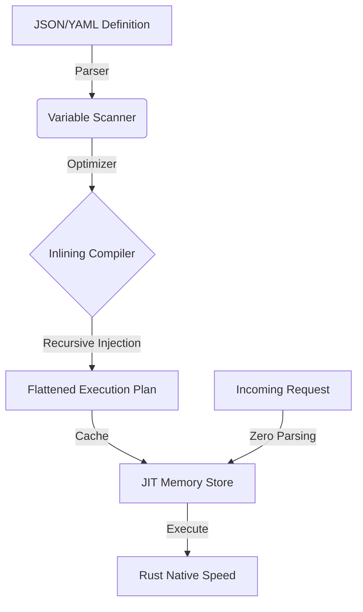

<div align="center">

```text
██╗    ██╗ ██████╗ ██████╗ ██████╗ ███████╗███╗   ██╗
██║    ██║██╔═══██╗██╔══██╗██╔══██╗██╔════╝████╗  ██║
██║ █╗ ██║██║   ██║██████╔╝██████╔╝█████╗  ██╔██╗ ██║
██║███╗██║██║   ██║██╔══██╗██╔═══╝ ██╔══╝  ██║╚██╗██║
╚███╔███╔╝╚██████╔╝██║  ██║██║     ███████╗██║ ╚████║
 ╚══╝╚══╝  ╚═════╝ ╚═╝  ╚═╝╚═╝     ╚══════╝╚═╝  ╚═══╝
                                                       
    🔥 LOGIC-AS-DATA • ZERO-COST INLINING • RUST CORE 🔥
```

# ⚡ **W O R P E N** ⚡
### **The High-Performance Dynamic Logic Engine**

[](https://www.rust-lang.org/)
[](https://github.com/matinsanei/worpen)
[](backend)
[](LICENSE)

<p align="center">
  <b>No Compilation</b> • <b>No Restarts</b> • <b>No Overhead</b>
</p>

> *"Forget about middleware. Define your business logic as data, and let Rust execute it at metal speed."*

[Quick Start](#-quick-start) • [Performance](#-benchmarks--performance) • [Architecture](#-under-the-hood) • [Contact](#-contact)

</div>

---

## 🌌 **THE PARADIGM SHIFT**

Software development is stuck in a loop: **Code ➡ Compile ➡ CI/CD ➡ Deploy.** Changing a simple `if` condition in production can take 30 minutes of pipeline time.

**Worpen** destroys this loop.

It is a **logic engine** written in Rust that treats your business logic (Routes, Functions, Conditions) as **Data**, not Code. It compiles your logic Just-In-Time (JIT) into optimized execution plans, giving you the flexibility of Python with the performance of Go/Rust.

### ✨ Key Features

- **🚀 Zero-Cost Function Inlining**: Worpen flattens your function calls at load time. Runtime function call overhead is literally **0ms**.
- **🔄 Hot-Swapping**: Update your API logic instantly without restarting the server or dropping connections.
- **⚡ Rust Async Core**: Built on top of `Axum` and `Tokio`, capable of handling thousands of concurrent connections.
- **🛡️ Memory Safety**: Variable scoping (`_0_val`) and memory management are handled automatically and safely by Rust.
- **🌐 Service Mesh**: Native HTTP client allows Worpen to orchestrate other microservices effortlessly.

---

## 📊 **BENCHMARKS & PERFORMANCE**

We don't sell dreams; we sell engineering. Here is how Worpen stacks up against industry giants.

### The Logic Engine (Internal Speed)
When stripped of network latency, the Worpen logic interpreter processes over **250,000 operations per second**.

### End-to-End API Performance (Real World)
*Standard HTTP JSON POST benchmark, 125 concurrent connections, localhost.*

| Framework | Technology | Throughput (Req/s) | Latency | Analysis |
| :--- | :--- | :--- | :--- | :--- |
| **Go (Gin)** | Static Compiled | **~17,500** | ~6ms | Metal performance. Hard to develop/change. |
| **Worpen** | **Dynamic Engine** | **~9,000 - 20,000** | **~14ms** | **Incredible.** Dynamic logic running at near-static speeds. |
| **Node.js (Fastify)** | JIT Compiled | ~3,500 | ~30ms | Worpen is **~3x - 5x faster**. |
| **Python (FastAPI)** | Interpreted | ~1,500 | ~60ms | Worpen is **~10x faster**. |

> **Verdict:** Worpen effectively eliminates the "Dynamic Language Tax". You get the ease of a dynamic system with performance rivaling compiled languages.

---

## 🧠 **UNDER THE HOOD: HOW IT WORKS**

Worpen isn't just an interpreter; it's a **Runtime Compiler**.



1.  **Parse:** The engine reads your definition.
2.  **Inlining:** It recursively finds all `CallFunction` nodes, injects the code into the main route, and handles **Variable Mangling** (e.g., `product` becomes `_0_product`) to prevent collisions.
3.  **Execute:** The final execution path is linear. The CPU predicts branches perfectly. No stack jumps. No context switches.

---

## 🚀 **QUICK START**

### 1. Fire up the Engine

```bash
cargo run --release
# Server listening on 127.0.0.1:3000
```

### 2. Define a "Global Function"

Let's create a reusable logic block. Note that we use `MathOp`, but the engine inlines it.

```bash
curl -X POST http://127.0.0.1:3000/api/v1/global-functions \
  -H "Content-Type: application/json" \
  -d '{
    "name": "calculate_tax",
    "params": ["price"],
    "logic": [
      {
        "math_op": { "operation": "multiply", "args": ["{{price}}", 1.09] }
      },
      {
        "set": { "var": "final", "value": "{{math_result}}" }
      }
    ]
  }'
```

### 3. Create an API Route

Now create the API endpoint. Notice `call_function` here implies no runtime cost.

```bash
curl -X POST http://127.0.0.1:3000/api/v1/dynamic-routes \
  -H "Content-Type: application/json" \
  -d '{
    "name": "checkout_api",
    "path": "/api/checkout",
    "method": "POST",
    "enabled": true,
    "logic": [
      { "set": { "var": "user_price", "value": 100 } },
      {
        "call_function": {
          "name": "calculate_tax",
          "args": ["{{user_price}}"],
          "output_var": "total"
        }
      },
      {
        "return": { "value": { "status": "OK", "amount": "{{total}}" } }
      }
    ]
  }'
```

### 4. Test It

```bash
curl -X POST http://127.0.0.1:3000/api/checkout
# Response: {"status": "OK", "amount": "109.0"}
```

---

## 🔮 **FUTURE ROADMAP**

We are building the future of backend development.

- [x] **Core:** Zero-Cost Function Inlining & Logic Engine.
- [x] **Network:** Native HTTP Request/Response handling.
- [x] **Testing:** Comprehensive CI/CD with 260+ tests.
- [ ] **AI Inference:** Run ONNX models directly inside Worpen (Zero-Copy tensors).
- [ ] **Embedded Scripting:** Support for Lua/JS/Python via WebAssembly.
- [ ] **Cluster:** Raft-based distributed state.

---

## 🤝 **CONTRIBUTING**

Worpen is an open project born from the desire to break the status quo. If you love Rust, Compilers, or DevOps, join us.

1.  **Fork** & **Clone**.
2.  `cargo test` (We have 262 tests guarding the core).
3.  **PRs are welcome!**

---

<div align="center">

## 👨‍💻 Author

**Matin Sanei**
<a href="https://github.com/matinsanei"></a>

*"The fastest code is the code you never write."*

**MIT Licensed** • Copyright © 2025 Worpen

</div>