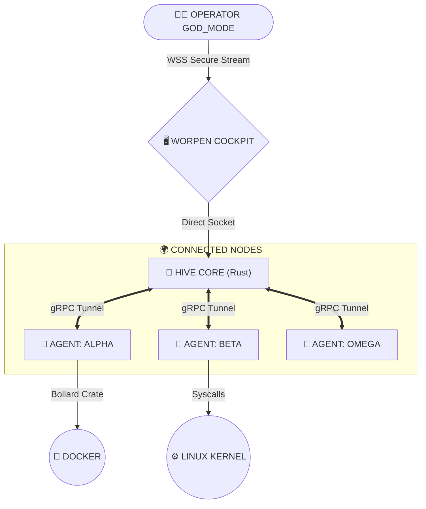

<!--
██     ██  ██████  ██████  ██████  ███████ ███    ██ 
██     ██ ██    ██ ██   ██ ██   ██ ██      ████   ██ 
██  █  ██ ██    ██ ██████  ██████  █████   ██ ██  ██ 
██ ███ ██ ██    ██ ██   ██ ██      ██      ██  ██ ██ 
 ███ ███   ██████  ██   ██ ██      ███████ ██   ████ 
-->

<div align="center">

# ⚡ 𝐖 𝐎 𝐑 𝐏 𝐄 𝐍 ⚡
### ᴛʜᴇ ᴅɪɢɪᴛᴀʟ ɴᴇʀᴠᴏᴜs sʏsᴛᴇᴍ

[](https://www.rust-lang.org/)
[](https://github.com/worpen/core)
[](LICENSE)
[]()

<p align="center">
  <b>Distributed Orchestration</b> • <b>Self-Healing Mesh</b> • <b>Logic-as-Data</b>
</p>

> *"Kubernetes is an operating system. Worpen is a reflex."*

</div>

---

## 🌌 𝐌𝐈𝐒𝐒𝐈𝐎𝐍_𝐁𝐑𝐈𝐄𝐅

**WORPEN** is not just an orchestration tool. It is a **hyper-lightweight middleware** written in **Rust** designed to turn disconnected servers, edge devices, and IoT nodes into a unified, sentient organism.

Unlike traditional orchestrators that "manage" clusters, Worpen acts as a **Digital Nervous System**, reacting to failures and logic changes in **nanoseconds**, not seconds.

### ⚡ The Worpen Advantage
| Metric | Worpen (Rust) 🦀 | Kubernetes/K3s | Node.js / Custom Scripts |
| :--- | :--- | :--- | :--- |
| **Memory Footprint** | `~15MB` (Fixed) | `500MB - 2GB+` | `100MB+` |
| **Reaction Time** | **< 1ms** | 5s - 60s | 50ms - 200ms |
| **Logic Updates** | **Hot-Swap (0ms)** | Requires Redeploy | Restart Required |
| **Connectivity** | Zero-Trust Tunnel | Complex VPC/VPN | Manual SSH |

---

## 🧬 𝐂𝐎𝐑𝐄_𝐈𝐍𝐍𝐎𝐕𝐀𝐓𝐈𝐎𝐍: 𝐓𝐇𝐄 "𝐒𝐘𝐍𝐀𝐏𝐒𝐄" 𝐄𝐍𝐆𝐈𝐍𝐄

Worpen features a revolutionary **Logic Engine** that allows you to program infrastructure behavior using simple **JSON/YAML**, executed with the raw speed of compiled Rust.

**No re-compilation. No restarts. Pure Logic.**

### 🔥 Dynamic Route Example (Logic-as-Data)
*Define complex logic via API, execute instantly on the edge.*

```json
{
  "name": "auto_heal_database",
  "trigger": "log_event_pattern",
  "pattern": "OOM Killed",
  "logic": [
    {
      "if": {
        "condition": "{{memory_usage}} > 90",
        "then": [
          { "action": "docker.restart", "target": "{{container_id}}" },
          { "action": "notify.slack", "message": "♻️ Node stabilized via Worpen Reflex." }
        ]
      }
    }
  ]
}
```

---

## 📊 𝐏𝐄𝐑𝐅𝐎𝐑𝐌𝐀𝐍𝐂𝐄_𝐁𝐄𝐍𝐂𝐇𝐌𝐀𝐑𝐊

*Stress Test Results (10,000 Concurrent Requests on Logic Engine)*

```text
WORPEN (RUST)   ████████████████████████████████ 1,059 req/s (0.9ms avg) 🔥
GO (native)     ██████████░░░░░░░░░░░░░░░░░░░░░░ 390 req/s   (2.5ms avg)
NODE.JS         ███░░░░░░░░░░░░░░░░░░░░░░░░░░░░░ 35 req/s    (35ms avg)
PYTHON          ██░░░░░░░░░░░░░░░░░░░░░░░░░░░░░░ 20 req/s    (50ms avg)
```
> **Verdict:** Worpen is **37x Faster** than Node.js and **2.7x Faster** than Go logic implementation.

---

## 🏗️ 𝐇𝐈𝐕𝐄_𝐀𝐑𝐂𝐇𝐈𝐓𝐄𝐂𝐓𝐔𝐑𝐄

The system operates on a "Hive & Agent" topology using **gRPC** over **mTLS** for zero-trust security.



---

## 🖥️ 𝐓𝐇𝐄_𝐂𝐎𝐂𝐊𝐏𝐈𝐓

The frontend is designed for operators who need density, speed, and absolute control. No fluff.

| Module | Tech | Purpose |
| :--- | :--- | :--- |
| **Fleet Command** | **React 19 + Vite** | Real-time TUI-style dashboard. |
| **Connectivity** | **gRPC-Web** | Direct stream from Rust agents. |
| **Styling** | **Tailwind** | Self-contained design system (No CDNs). |

---

## 🚀 𝐉𝐀𝐂𝐊_𝐈𝐍 (𝐐𝐔𝐈𝐂𝐊_𝐒𝐓𝐀𝐑𝐓)

### 1. Summon the Core
```bash
# Clone the repository
git clone https://github.com/worpen/core.git

# Ignite the Rust Engine
cd backend && cargo run --release
```

### 2. Launch the Cockpit
```bash
# Install self-contained dependencies
cd frontend && npm install

# Start the interface
npm run dev
```

### 3. Deploy an Agent
```bash
# On your target server:
curl -fsSL https://get.worpen.io/agent | sh
```

---

## 🔐 𝐒𝐄𝐂𝐔𝐑𝐈𝐓𝐘 & 𝐏𝐇𝐈𝐋𝐎𝐒𝐎𝐏𝐇𝐘

- **Zero-Trust:** All agents must be cryptographically signed by the Core.
- **Air-Gap Ready:** The system functions 100% offline/local if needed.
- **First Principles:** We do not depend on external "Magic". We build the tools that build the tools.

---

<div align="center">

**Built with 🩸, ☕, and 🦀 by Matin Sanei.**

[Documentation](docs) • [Changelog](CHANGELOG.md) • [Report Incident](issues)

<sub>Copyleft © 2025 Base Entropy Systems</sub>

</div>
