# 🧠 𝐂𝐎𝐑𝐄_𝐁𝐑𝐀𝐈𝐍 [𝐁𝐀𝐂𝐊𝐄𝐍𝐃]

> *"The synaptic center of the Worpen nervous system."*

The **Backend** is the central nervous system of Worpen, implemented as a high-performance **Rust** workspace. It orchestrates the Hive, processes telemetry, and serves the Cockpit UI.

---

## 🏗️ 𝐀𝐑𝐂𝐇𝐈𝐓𝐄𝐂𝐓𝐔𝐑𝐄 [𝐖𝐎𝐑𝐊𝐒𝐏𝐀𝐂𝐄]

The backend follows a modular **Clean Architecture** approach using Rust workspaces:

| CRATE | PATH | TYPE | DESCRIPTION |
| :--- | :--- | :--- | :--- |
| **API** | [`crates/api`](crates/api) | `Entry Point` | The neuron interface. Exposes HTTP/REST/gRPC endpoints (Axum) for the Cockpit and external systems. |
| **CORE** | [`crates/core`](crates/core) | `Domain` | Pure business logic and domain entities. The "thought" processing center. Zero external dependencies where possible. Now renamed to `worpen-core` to avoid std::core collision. |
| **INFRA** | [`crates/infra`](crates/infra) | `Infrastructure` | Database connections, external adapters, and system I/O. The physical link to the digital world. |
| **PROTO** | [`crates/proto`](crates/proto) | `Shared` | Protocol definitions, shared types, and DTOs. The "language" of the Hive. |

```mermaid
graph TD
    API[🔌 API LAYER] --> Service[⚙️ SERVICE LAYER]
    Service --> Core[🧠 CORE DOMAIN]
    Service --> Repo[🗄️ REPOSITORY PORT]
    
    subgraph INFRA [🏗️ INFRA LAYER]
        Sqlite[💾 SQLITE ADAPTER] -- implements --> Repo
    end
    
    API --> Sqlite
    
    subgraph SHARED [📦 SHARED RESOURCES]
        Proto[📝 PROTO DEFS]
    end
    
    API -.-> Proto
    Core -.-> Proto
    Infra -.-> Proto
```



### Key Components

*   **Service Layer (`AgentService`)**: Encapsulates business logic, ensuring the API doesn't talk directly to the database.
*   **Repository Pattern**: Abstracts data storage. We switched from Memory to **SQLite** without touching Core logic.
*   **Database**: Uses `sqlx` with automatic migrations on startup (`worpen.db`).

---

## 📡 𝐀𝐏𝐈_𝐒𝐏𝐄𝐂𝐈𝐅𝐈𝐂𝐀𝐓𝐈𝐎𝐍

This specification correlates directly with the Frontend Views and Mock Data (`constants.ts`).

### 1. 📊 Dashboard & Telemetry
| METHOD | ROUTE | DESC | PAYLOAD / PARAMS |
| :--- | :--- | :--- | :--- |
| `GET` | `/api/v1/dashboard/stats` | Aggregated KPIs (Nodes, Throughput, Load, Security). | - |
| `GET` | `/api/v1/dashboard/network` | Historical network traffic data (Inbound/Outbound). | `?range=1h` |
| `GET` | `/api/v1/dashboard/services` | Service Health Matrix (Status, Latency, Load). | - |
| `GET` | `/api/v1/dashboard/load` | Cluster Load Distribution (Predicted vs Actual). | `?range=24h` |

### 0. 🚀 Dynamic Routes (YAML/JSON-Driven API Engine)
| METHOD | ROUTE | DESC | PAYLOAD / PARAMS |
| :--- | :--- | :--- | :--- |
| `GET` | `/api/v1/dynamic-routes` | List all registered dynamic routes. | - |
| `POST` | `/api/v1/dynamic-routes` | Register a new YAML/JSON-driven API route. | `{ name, path, method, logic, parameters }` |
| `DELETE` | `/api/v1/dynamic-routes/{id}` | Delete a registered route. | - |
| `POST` | `/api/v1/dynamic-routes/test` | Test a route with mock payload. | `{ route_id, test_payload, test_params }` |
| `ANY` | `/api/custom/*` | Execute user-defined dynamic routes. | Varies per route definition |

**🎯 Format Support:**
- ✅ **YAML** - Human-friendly syntax (recommended)
- ✅ **JSON** - Machine-friendly format
- 🔄 Auto-detection based on content

**⚡ Performance:**
- Parsing: **3-5µs** (250,000 routes/second)
- Tokenization: **200-900ns**
- Evaluation: **3-4µs**

**🔧 Features:**
- 30+ pipe filters (upper, lower, hash, base64, etc.)
- 25+ helper functions (date, UUID, validation, etc.)
- 4 loop types (for_each, while, until, loop with break/continue)
- Expression engine with full operators (+, -, *, /, %, **, ==, !=, >, <, &&, ||, !, ternary)
- **SQL operations with parameterized queries (VM-optimized)** ⚡
- **Redis operations with connection pooling (VM-optimized)** ⚡ NEW
- HTTP requests with timeout/retry
- Conditional logic (if/else)
- Error handling (try/catch)
- Variable scoping and metadata

**💾 Database Operations (SqlOp):**
- Parameterized queries (SQL injection safe)
- Full VM optimization (3-5µs overhead)
- Variable interpolation
- Transaction support

**⚡ Caching Operations (RedisOp - NEW):**
- 6 commands: GET, SET, DEL, EXPIRE, INCR, DECR
- Connection pooling with deadpool-redis
- Sub-millisecond response times
- Variable interpolation in keys/values
- Automatic TTL management
- Atomic counter operations

### 2. 🐝 Fleet (Agents)
| METHOD | ROUTE | DESC | PAYLOAD / PARAMS |
| :--- | :--- | :--- | :--- |
| `GET` | `/api/v1/agents` | List all connected agents/nodes. | `?status=ONLINE` |
| `GET` | `/api/v1/agents/{id}` | Detailed telemetry for a specific agent. | - |
| `POST` | `/api/v1/agents/sync` | Force a synchronization signal across the mesh. | `{ target: "all" }` |
| `POST` | `/api/v1/internal/heartbeat` | **[INTERNAL]** Agent pulse check-in. | `{ id, cpu, ram, status }` |

### 3. 📦 Docker & Orchestration
| METHOD | ROUTE | DESC | PAYLOAD / PARAMS |
| :--- | :--- | :--- | :--- |
| `GET` | `/api/v1/containers` | List all containers across the fleet. | `?node=bee-001` |
| `GET` | `/api/v1/containers/{id}/logs` | Stream stdout/stderr from a container. | `?tail=100` |
| `POST` | `/api/v1/containers/{id}/start` | Start a stopped container. | - |
| `POST` | `/api/v1/containers/{id}/stop` | Stop a running container. | - |
| `POST` | `/api/v1/containers/{id}/restart` | Restart a container (commonly used by Auto-Healer). | - |
| `DELETE`| `/api/v1/containers/{id}` | Remove a container. | `?force=true` |
| `POST` | `/api/v1/docker/prune` | System Prune (Remove unused images/networks). | `{ all: true }` |
| `GET` | `/api/v1/images` | List cached container images and layers. | - |
| `POST` | `/api/v1/images/pull` | Pull a new image tag. | `{ image: "repo/name:tag" }` |

### 4. 🤖 Automation (Self-Healing)
| METHOD | ROUTE | DESC | PAYLOAD / PARAMS |
| :--- | :--- | :--- | :--- |
| `GET` | `/api/v1/automation/rules` | List all active healing strategies. | - |
| `GET` | `/api/v1/automation/rules/{id}` | Get specific rule script. | - |
| `POST` | `/api/v1/automation/rules` | Create a new automation strategy. | `{ name, trigger, script }` |
| `PUT` | `/api/v1/automation/rules/{id}` | Update script or toggle active state. | `{ script, active: true }` |
| `POST` | `/api/v1/automation/dry-run` | Test run a script in a sandbox. | `{ script, mockContext }` |

### 5. 🚨 Incidents & Logs
| METHOD | ROUTE | DESC | PAYLOAD / PARAMS |
| :--- | :--- | :--- | :--- |
| `GET` | `/api/v1/incidents` | List active and resolved incidents. | `?status=PENDING` |
| `POST` | `/api/v1/incidents/{id}/resolve` | Mark an incident as resolved. | `{ method: "MANUAL", notes: "..." }` |
| `GET` | `/api/v1/logs` | Centralized log stream. | `?level=ERROR&source=bee-001` |

### 6. 🏗️ CI/CD Pipelines
| METHOD | ROUTE | DESC | PAYLOAD / PARAMS |
| :--- | :--- | :--- | :--- |
| `GET` | `/api/v1/pipelines` | List pipeline execution history. | - |
| `POST` | `/api/v1/pipelines/trigger` | Manually trigger a pipeline. | `{ pipelineId: "pipe-001" }` |

---

## 🔋 𝐒𝐘𝐒𝐓𝐄𝐌_𝐒𝐓𝐀𝐓𝐔𝐒

[](https://www.rust-lang.org/)
[](https://github.com/tokio-rs/axum)
[](https://tokio.rs/)
[](https://www.sqlite.org/)

**Active Routes:** 7+ | **Dynamic API Engine:** ONLINE | **Response Time:** <4ms

---

## 🚀 𝐈𝐍𝐈𝐓𝐈𝐀𝐋𝐈𝐙𝐀𝐓𝐈𝐎𝐍

To ignite the Core Brain, ensure you have the **Rust Toolchain** installed.

### 1. 🔍 Verification
Run a neural link check across all modules:

```bash
cargo check
```

### 2. ⚡ Ignition
Start the API server (Core Brain):

```bash
cargo run -p api
```

The system will come online at:
> `http://127.0.0.1:3000`

### 3. 🩺 Diagnostics
Ping the health status to verify neural pathways:

```bash
curl http://127.0.0.1:3000/health
```
> Response: `OK`

---

## 🛠️ 𝐃𝐄𝐕𝐄𝐋𝐎𝐏𝐌𝐄𝐍𝐓

### Adding a New Dependency
To inject a new capability into a specific module (e.g., adding `serde` to `core`):

```bash
cargo add serde -p core --features derive
```

### Running Tests
Execute the comprehensive test suite:

```bash
cargo test --workspace
```

### Database Migrations
Migrations run automatically on startup. Manual migration:

```bash
sqlx migrate run --database-url sqlite:worpen.db
```

---

## 🚀 𝐃𝐘𝐍𝐀𝐌𝐈𝐂_𝐑𝐎𝐔𝐓𝐄𝐒_𝐐𝐔𝐈𝐂𝐊_𝐒𝐓𝐀𝐑𝐓

Create APIs without writing code - just YAML or JSON definitions!

### Why YAML?

✅ **More Readable** - 60% less syntax noise than JSON  
✅ **Easier to Write** - No commas, fewer quotes, natural indentation  
✅ **Same Performance** - 3-5µs parsing (identical to JSON)  
✅ **Full Compatibility** - All JSON features work in YAML  

### Quick Example: User Management API

**YAML Format (Recommended):**
```yaml
path: /users/:id
method: GET

logic:
  # Extract user ID from URL
  - variable: user_id
    value: "{{ request.params.id }}"
  
  # Query database with parameterized query (SQL injection safe)
  - sql:
      query: SELECT id, name, email FROM users WHERE id = :user_id
      params:
        user_id: "{{ user_id }}"
    assign: user
  
  # Handle not found
  - if: "{{ user == null }}"
    then:
      - return:
          status: 404
          body:
            error: User not found

response:
  status: 200
  body: "{{ user }}"
```

**JSON Format (Also Supported):**
```json
{
  "path": "/users/:id",
  "method": "GET",
  "logic": [
    {
      "variable": "user_id",
      "value": "{{ request.params.id }}"
    },
    {
      "sql": {
        "query": "SELECT id, name, email FROM users WHERE id = :user_id",
        "params": { "user_id": "{{ user_id }}" }
      },
      "assign": "user"
    },
    {
      "if": "{{ user == null }}",
      "then": [
        {
          "return": {
            "status": 404,
            "body": { "error": "User not found" }
          }
        }
      ]
    }
  ],
  "response": {
    "status": 200,
    "body": "{{ user }}"
  }
}
```

### Expression Examples

```yaml
# Arithmetic
"{{ price * quantity }}"
"{{ (total - discount) * (1 + tax / 100) }}"

# String operations
"{{ name | upper | trim }}"
"{{ email | lower }}"

# Validation
"{{ is_email(email) }}"
"{{ age >= 18 && age <= 65 }}"

# Array operations
"{{ items | filter('price > 100') | map('name') | join(', ') }}"
"{{ numbers | sum }}"

# Conditional
"{{ age >= 18 ? 'adult' : 'minor' }}"

# Date/Time
"{{ now_iso() }}"
"{{ add_days(today(), 7) }}"

# Crypto
"{{ password | hash_bcrypt }}"
"{{ data | base64_encode }}"
```

### Advanced Example: E-Commerce Order Processing

```yaml
path: /orders/:id/process
method: POST

logic:
  # Validate authentication
  - variable: auth_token
    value: "{{ request.headers.authorization }}"
  
  - if: "{{ auth_token == null }}"
    then:
      - return:
          status: 401
          body: { error: Unauthorized }
  
  # Get order
  - sql:
      query: SELECT * FROM orders WHERE id = :order_id
      params:
        order_id: "{{ request.params.id }}"
    assign: order
  
  # Validate order status
  - if: "{{ order.status != 'pending' }}"
    then:
      - return:
          status: 400
          body: { error: Order already processed }
  
  # Get order items
  - sql:
      query: SELECT * FROM order_items WHERE order_id = :order_id
      params:
        order_id: "{{ request.params.id }}"
    assign: items
  
  # Calculate total with loop
  - variable: total
    value: 0
  
  - for_each: "{{ items }}"
    as: item
    do:
      - variable: item_total
        value: "{{ item.price * item.quantity }}"
      
      - variable: total
        value: "{{ total + item_total }}"
  
  # Update order
  - sql:
      query: |
        UPDATE orders 
        SET status = 'completed', total = :total 
        WHERE id = :order_id
      params:
        total: "{{ total }}"
        order_id: "{{ request.params.id }}"

response:
  status: 200
  body:
    message: Order processed successfully
    total: "{{ total }}"
    items_count: "{{ items | length }}"
```

### Register and Test Routes

**Register via API:**
```bash
# YAML route
curl -X POST http://127.0.0.1:3000/api/v1/dynamic-routes \
  -H "Content-Type: application/x-yaml" \
  --data-binary @user-api.yaml

# JSON route
curl -X POST http://127.0.0.1:3000/api/v1/dynamic-routes \
  -H "Content-Type: application/json" \
  -d @user-api.json
```

**Test the route:**
```bash
curl -X GET http://127.0.0.1:3000/users/123

# Response:
# {
#   "id": 123,
#   "name": "John Doe",
#   "email": "john@example.com"
# }
```

### 📚 Documentation

Comprehensive guides available in `documentation/`:

| Guide | Description | Lines |
|-------|-------------|-------|
| [YAML Syntax Guide](../documentation/13-yaml-syntax.md) | Complete YAML syntax reference | 890+ |
| [Expression Reference](../documentation/14-expressions.md) | All operators, functions, pipes | 750+ |
| [Migration Guide](../documentation/15-migration-guide.md) | JSON to YAML conversion | 650+ |
| [Best Practices](../documentation/16-best-practices.md) | Patterns, security, optimization | 500+ |

### 📦 Example Routes

See [`examples/`](../examples/) directory for production-ready templates:

- **User Management** - CRUD operations with validation
- **E-commerce** - Order processing with inventory updates
- **Authentication** - JWT tokens, session management
- **Games** - Physics simulation, game state management
- **Calculator** - Expression evaluation API
- **Batch Processing** - Loop patterns, data transformation

### 🎯 Key Features

- **Zero Code Deployment** - Define APIs in YAML/JSON, no Rust compilation needed
- **Hot Reload** - Register routes at runtime without restart
- **SQL Injection Safe** - Parameterized queries by default
- **Expression Engine** - Full-featured with 30+ filters, 25+ helpers
- **Loop Support** - for_each, while, until, loop with break/continue
- **Error Handling** - try/catch blocks with graceful fallbacks
- **Validation** - Built-in validators (email, URL, etc.)
- **Metadata Access** - Loop iteration info, timestamps, etc.

### ⚡ Performance

Benchmark results (Criterion framework):

```
parse_simple_yaml        4.05 µs
parse_complex_yaml       5.21 µs
tokenize_expression      227 ns
evaluate_arithmetic      3.00 µs
evaluate_complex         3.84 µs

Throughput: 250,000 routes/second
```

**Real-world impact:**
- Comparable to Node.js Express (10-50µs overhead)
- Faster than Python Flask (50-200µs overhead)
- Negligible vs raw Axum handlers (<1% difference)

### 🧪 Testing

252 tests covering all features:
- 174 unit tests (expression engine, parser, tokenizer)
- 32 error handling tests (edge cases, validation)
- 10 end-to-end tests (full route execution)
- 10 integration tests (SQL, HTTP, loops)
- 9 validation tests (input sanitization)
- 9 format tests (YAML, JSON parsing)
- 8 doctests (example code verification)

---

<div align="center">
  <sub>Authorized Personnel Only. Worpen Corp. 2024-2025</sub>
</div>
