# 🧠 𝐂𝐎𝐑𝐄_𝐁𝐑𝐀𝐈𝐍 [𝐁𝐀𝐂𝐊𝐄𝐍𝐃]

> *"The synaptic center of the Worpen nervous system."*

The **Backend** is the central nervous system of Worpen, implemented as a high-performance **Rust** workspace. It orchestrates the Hive, processes telemetry, and serves the Cockpit UI.

---

## 🏗️ 𝐀𝐑𝐂𝐇𝐈𝐓𝐄𝐂𝐓𝐔𝐑𝐄 [𝐖𝐎𝐑𝐊𝐒𝐏𝐀𝐂𝐄]

The backend follows a modular **Clean Architecture** approach using Rust workspaces:

| CRATE | PATH | TYPE | DESCRIPTION |
| :--- | :--- | :--- | :--- |
| **API** | [`crates/api`](crates/api) | `Entry Point` | The neuron interface. Exposes HTTP/REST/gRPC endpoints (Axum) for the Cockpit and external systems. |
| **CORE** | [`crates/core`](crates/core) | `Domain` | Pure business logic and domain entities. The "thought" processing center. Zero external dependencies where possible. |
| **INFRA** | [`crates/infra`](crates/infra) | `Infrastructure` | Database connections, external adapters, and system I/O. The physical link to the digital world. |
| **PROTO** | [`crates/proto`](crates/proto) | `Shared` | Protocol definitions, shared types, and DTOs. The "language" of the Hive. |

```mermaid
graph TD
    API[🔌 API LAYER] --> Service[⚙️ SERVICE LAYER]
    Service --> Core[🧠 CORE DOMAIN]
    Service --> Repo[🗄️ REPOSITORY PORT]
    
    subgraph INFRA [🏗️ INFRA LAYER]
        Sqlite[💾 SQLITE ADAPTER] -- implements --> Repo
    end
    
    API --> Sqlite
    
    subgraph SHARED [📦 SHARED RESOURCES]
        Proto[📝 PROTO DEFS]
    end
    
    API -.-> Proto
    Core -.-> Proto
    Infra -.-> Proto
```



### Key Components

*   **Service Layer (`AgentService`)**: Encapsulates business logic, ensuring the API doesn't talk directly to the database.
*   **Repository Pattern**: Abstracts data storage. We switched from Memory to **SQLite** without touching Core logic.
*   **Database**: Uses `sqlx` with automatic migrations on startup (`worpen.db`).

---

## 📡 𝐀𝐏𝐈_𝐒𝐏𝐄𝐂𝐈𝐅𝐈𝐂𝐀𝐓𝐈𝐎𝐍

This specification correlates directly with the Frontend Views and Mock Data (`constants.ts`).

### 1. 📊 Dashboard & Telemetry
| METHOD | ROUTE | DESC | PAYLOAD / PARAMS |
| :--- | :--- | :--- | :--- |
| `GET` | `/api/v1/dashboard/stats` | Aggregated KPIs (Nodes, Throughput, Load, Security). | - |
| `GET` | `/api/v1/dashboard/network` | Historical network traffic data (Inbound/Outbound). | `?range=1h` |
| `GET` | `/api/v1/dashboard/services` | Service Health Matrix (Status, Latency, Load). | - |
| `GET` | `/api/v1/dashboard/load` | Cluster Load Distribution (Predicted vs Actual). | `?range=24h` |

### 2. 🐝 Fleet (Agents)
| METHOD | ROUTE | DESC | PAYLOAD / PARAMS |
| :--- | :--- | :--- | :--- |
| `GET` | `/api/v1/agents` | List all connected agents/nodes. | `?status=ONLINE` |
| `GET` | `/api/v1/agents/{id}` | Detailed telemetry for a specific agent. | - |
| `POST` | `/api/v1/agents/sync` | Force a synchronization signal across the mesh. | `{ target: "all" }` |
| `POST` | `/api/v1/internal/heartbeat` | **[INTERNAL]** Agent pulse check-in. | `{ id, cpu, ram, status }` |

### 3. 📦 Docker & Orchestration
| METHOD | ROUTE | DESC | PAYLOAD / PARAMS |
| :--- | :--- | :--- | :--- |
| `GET` | `/api/v1/containers` | List all containers across the fleet. | `?node=bee-001` |
| `GET` | `/api/v1/containers/{id}/logs` | Stream stdout/stderr from a container. | `?tail=100` |
| `POST` | `/api/v1/containers/{id}/start` | Start a stopped container. | - |
| `POST` | `/api/v1/containers/{id}/stop` | Stop a running container. | - |
| `POST` | `/api/v1/containers/{id}/restart` | Restart a container (commonly used by Auto-Healer). | - |
| `DELETE`| `/api/v1/containers/{id}` | Remove a container. | `?force=true` |
| `POST` | `/api/v1/docker/prune` | System Prune (Remove unused images/networks). | `{ all: true }` |
| `GET` | `/api/v1/images` | List cached container images and layers. | - |
| `POST` | `/api/v1/images/pull` | Pull a new image tag. | `{ image: "repo/name:tag" }` |

### 4. 🤖 Automation (Self-Healing)
| METHOD | ROUTE | DESC | PAYLOAD / PARAMS |
| :--- | :--- | :--- | :--- |
| `GET` | `/api/v1/automation/rules` | List all active healing strategies. | - |
| `GET` | `/api/v1/automation/rules/{id}` | Get specific rule script. | - |
| `POST` | `/api/v1/automation/rules` | Create a new automation strategy. | `{ name, trigger, script }` |
| `PUT` | `/api/v1/automation/rules/{id}` | Update script or toggle active state. | `{ script, active: true }` |
| `POST` | `/api/v1/automation/dry-run` | Test run a script in a sandbox. | `{ script, mockContext }` |

### 5. 🚨 Incidents & Logs
| METHOD | ROUTE | DESC | PAYLOAD / PARAMS |
| :--- | :--- | :--- | :--- |
| `GET` | `/api/v1/incidents` | List active and resolved incidents. | `?status=PENDING` |
| `POST` | `/api/v1/incidents/{id}/resolve` | Mark an incident as resolved. | `{ method: "MANUAL", notes: "..." }` |
| `GET` | `/api/v1/logs` | Centralized log stream. | `?level=ERROR&source=bee-001` |

### 6. 🏗️ CI/CD Pipelines
| METHOD | ROUTE | DESC | PAYLOAD / PARAMS |
| :--- | :--- | :--- | :--- |
| `GET` | `/api/v1/pipelines` | List pipeline execution history. | - |
| `POST` | `/api/v1/pipelines/trigger` | Manually trigger a pipeline. | `{ pipelineId: "pipe-001" }` |

---

## 🔋 𝐒𝐘𝐒𝐓𝐄𝐌_𝐒𝐓𝐀𝐓𝐔𝐒

[](https://www.rust-lang.org/)
[](https://github.com/tokio-rs/axum)
[](https://tokio.rs/)

---

## 🚀 𝐈𝐍𝐈𝐓𝐈𝐀𝐋𝐈𝐙𝐀𝐓𝐈𝐎𝐍

To ignite the Core Brain, ensure you have the **Rust Toolchain** installed.

### 1. 🔍 Verification
Run a neural link check across all modules:

```bash
cargo check
```

### 2. ⚡ Ignition
Start the API server (Core Brain):

```bash
cargo run -p api
```

The system will come online at:
> `http://127.0.0.1:3000`

### 3. 🩺 Diagnostics
Ping the health status to verify neural pathways:

```bash
curl http://127.0.0.1:3000/health
```
> Response: `OK`

---

## 🛠️ 𝐃𝐄𝐕𝐄𝐋𝐎𝐏𝐌𝐄𝐍𝐓

### Adding a New Dependency
To inject a new capability into a specific module (e.g., adding `serde` to `core`):

```bash
cargo add serde -p core --features derive
```

### Running Tests
Execute the comprehensive test suite:

```bash
cargo test --workspace
```

---

<div align="center">
  <sub>Authorized Personnel Only. Worpen Corp.</sub>
</div>
